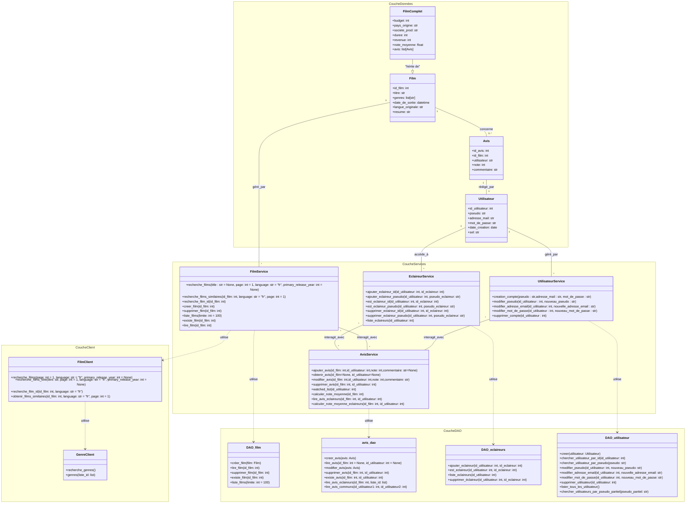

```mermaid
classDiagram
    namespace Couche Données {
        class Film {
            +id_film: int
            +titre: str
            +genres: list[str]
            +date_de_sortie: datetime
            +langue_originale: str
            +resume: str
        }

        class FilmComplet {
            +budget: int
            +pays_origine: str
            +societe_prod: str
            +duree: int
            +revenue: int
            +note_moyenne: float
            +avis: list[Avis]
        }

        class Utilisateur {
            +id_utilisateur: int
            +pseudo: str
            +adresse_mail: str
            +mot_de_passe: str
            +date_creation: date
            +sel: str
        }

        class Avis {
            +id_avis: int
            +id_film: int
            +utilisateur: str
            +note: int
            +commentaire: str
        }
    }

    namespace Couche DAO {
        class DAO_film {
            +créer_film(film: Film)
            +lire_film(id_film: int)
            +supprimer_film(id_film: int)
            +existe_film(id_film: int)
            +liste_films(limite: int = 100)
        }

        class avis_dao {
            +creer_avis(avis: Avis)
            +lire_avis(id_film: int = None, id_utilisateur: int = None)
            +modifier_avis(avis: Avis)
            +supprimer_avis(id_film: int, id_utilisateur: int)
            +existe_avis(id_film: int, id_utilisateur: int)
            +lire_avis_eclaireurs(id_film: int, liste_id: list)
            +lire_avis_communs(id_utilisateur1: int, id_utilisateur2: int)
        }

        class DAO_eclaireurs {
            +ajouter_eclaireur(id_utilisateur: int, id_eclaireur: int)
            +est_eclaireur(id_utilisateur: int, id_eclaireur: int)
            +liste_eclaireurs(id_utilisateur: int)
            +supprimer_éclaireur(id_utilisateur: int, id_eclaireur: int)
        }

        class DAO_utilisateur {
            +creer(utilisateur: Utilisateur)
            +chercher_utilisateur_par_id(id_utilisateur: int)
            +chercher_utilisateur_par_pseudo(pseudo: str)
            +modifier_pseudo(id_utilisateur: int, nouveau_pseudo: str)
            +modifier_adresse_email(id_utilisateur: int, nouvelle_adresse_email: str)
            +modifier_mot_de_passe(id_utilisateur: int, nouveau_mot_de_passe: str)
            +supprimer_utilisateur(id_utilisateur: int)
            +lister_tous_les_utilisateur()
            +chercher_utilisateurs_par_pseudo_partiel(pseudo_partiel: str)
        }
    }

    namespace Couche Services {
        class FilmService {
            +recherche_films(title : str = None, page: int = 1, language: str = "fr", primary_release_year: int = None)
            +recherche_films_similaires(id_film: int, language: str = "fr", page: int = 1)
            +recherche_film_id(id_film: int)
            +creer_film(id_film: int)
            +supprimer_film(id_film: int)
            +liste_films(limite: int = 100)
            +existe_film(id_film: int)
            +lire_film(id_film: int)
        }

        class AvisService {
            +ajouter_avis(id_film: int,id_utilisateur: int,note: int,commentaire: str=None)
            +obtenir_avis(id_film=None, id_utilisateur=None)
            +modifier_avis(id_film: int,id_utilisateur: int,note: int,commentaire: str)
            +supprimer_avis(id_film: int, id_utilisateur: int)
            +watched_list(id_utilisateur: int)
            +calculer_note_moyenne(id_film: int)
            +lire_avis_eclaireurs(id_film: int, id_utilisateur: int)
            +calculer_note_moyenne_eclaireurs(id_film: int, id_utilisateur: int)
            
        }

        class EclaireurService {
            +ajouter_eclaireur_id(id_utilisateur: int, id_eclaireur: int)
            +ajouter_eclaireur_pseudo(id_utilisateur: int, pseudo_eclaireur: str)
            +est_eclaireur_id(id_utilisateur: int, id_eclaireur: int)
            +est_eclaireur_pseudo(id_utilisateur: int, pseudo_eclaireur: str)
            +supprimer_eclaireur_id(id_utilisateur: int, id_eclaireur: int)
            +supprimer_eclaireur_pseudo(id_utilisateur: int, pseudo_eclaireur: str)
            +liste_eclaireurs(id_utilisateur: int)
        }

        class UtilisateurService {
            +creation_compte(pseudo : str,adresse_mail : str,  mot_de_passe : str)
            +modifier_pseudo(id_utilisateur : int, nouveau_pseudo : str)
            +modifier_adresse_email(id_utilisateur: int, nouvelle_adresse_email : str)
            +modifier_mot_de_passe(id_utilisateur : int, nouveau_mot_de_passe : str)
            +supprimer_compte(id_utilisateur : int)
        }
    }

    namespace Couche Client {
        class FilmClient {
            +recherche_films(page: int = 1, language: str = "fr", primary_release_year: int = None)
            +recherche_films_titre(titre: str, page: int = 1, language: str = "fr", primary_release_year: int = None)
            +recherche_film_id(id_film: int, language: str = "fr")
            +obtenir_films_similaires(id_film: int, language: str = "fr", page: int = 1)
        }

        class GenreClient {
            +recherche_genres()
            +genres(liste_id: list)
        }
    }

    %% Relations
    Film "1" -- "0..*" Avis : concerne
    Avis "1" -- "1" Utilisateur : rédigé_par
    EclaireurService"*" -- "*" AvisService : interagit_avec
    Utilisateur "1" -- "*" EclaireurService : accède_à
    Utilisateur "1" -- "*" UtilisateurService : géré_par
    Film "1" -- "*" FilmService : géré_par
    FilmService ..> FilmClient : utilise
    FilmService"*" -- "*" AvisService : interagit_avec
    UtilisateurService"*" -- "*" AvisService : interagit_avec
    FilmService ..>DAO_film : utilise
    AvisService ..> avis_dao : utilise
    EclaireurService ..> DAO_eclaireurs: utilise
    UtilisateurService ..> DAO_utilisateur : utilise
    FilmClient ..> GenreClient : utilise
    FilmComplet --|> Film : "hérite de"
```
