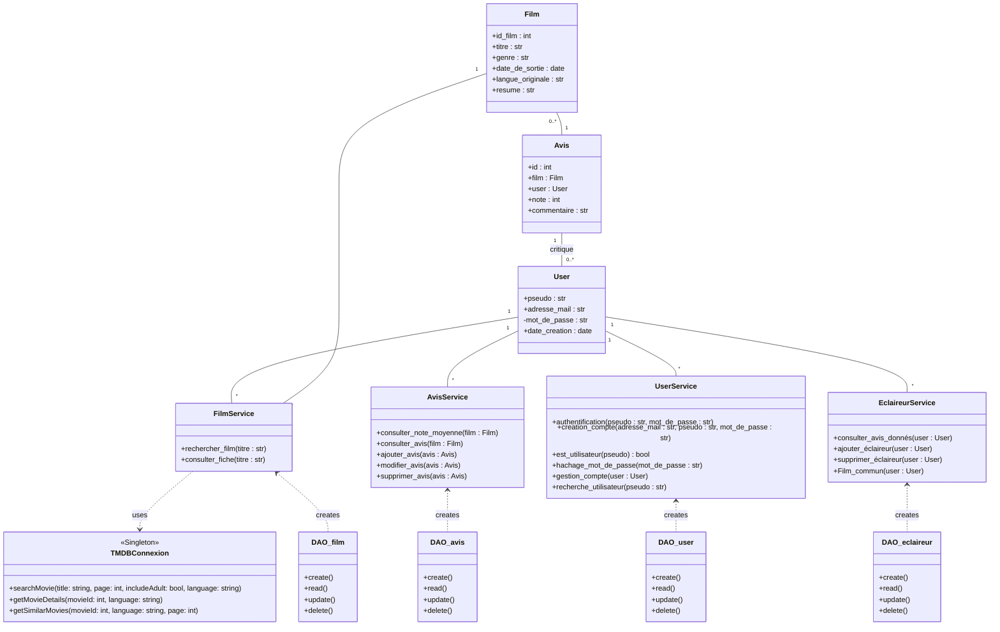

```mermaid
classDiagram
    class Film {
        +id_film : int
        +titre : str
        +genre : str
        +date_de_sortie : date
        +langue_originale : str
        +resume : str
    }

    class User {
        +pseudo : str
        +adresse_mail : str
        -mot_de_passe : str
        +date_creation : date
    }

    class Avis {
        +id : int
        +film : Film
        +user : User
        +note : int
        +commentaire : str
    }

    class FilmService {
        +rechercher_film(titre : str)
        +consulter_fiche(titre : str)
        
    }

    class AvisService {
        +consulter_note_moyenne(film : Film)
        +consulter_avis(film : Film)
        +ajouter_avis(avis : Avis)
        +modifier_avis(avis : Avis)
        +supprimer_avis(avis : Avis)
        
    }

    class EclaireurService {
        +consulter_avis_donnés(user : User)
        +ajouter_éclaireur(user : User)
        +supprimer_éclaireur(user : User)
        +Film_commun(user : User)
    }
    
    class TMDBConnexion {<<Singleton>>
        +searchMovie(title: string, page: int, includeAdult: bool, language: string)
        +getMovieDetails(movieId: int, language: string)
        +getSimilarMovies(movieId: int, language: string, page: int)
    }

    

    class DAO_film {
        +create()
        +read()
        +update()
        +delete()
    }

    class DAO_avis {
        +create()
        +read()
        +update()
        +delete()
    }

    class DAO_eclaireur {
        +create()
        +read()
        +update()
        +delete()
    }

    class DAO_user {
        +create()
        +read()
        +update()
        +delete()
    }

    class UserService {
        +authentification(pseudo : str, mot_de_passe : str)
        +creation_compte(adresse_mail : str, pseudo : str, mot_de_passe : str)
        +est_utilisateur(pseudo) bool
        +hachage_mot_de_passe(mot_de_passe : str)
        +gestion_compte(user : User)
        +recherche_utilisateur(pseudo : str)
    }

    Film "0..*" -- "1" Avis 
    Avis "1" -- "0..*" User : critique
    User "1" -- "*" FilmService
    User "1" -- "*" AvisService
    User "1" -- "*" UserService
    User "1" -- "*" EclaireurService
    Film "1" -- "*" FilmService

    FilmService ..> TMDBConnexion : uses
    

    FilmService <.. DAO_film : creates
    AvisService <..  DAO_avis : creates
    EclaireurService <.. DAO_eclaireur : creates
    UserService <..  DAO_user : creates
```
