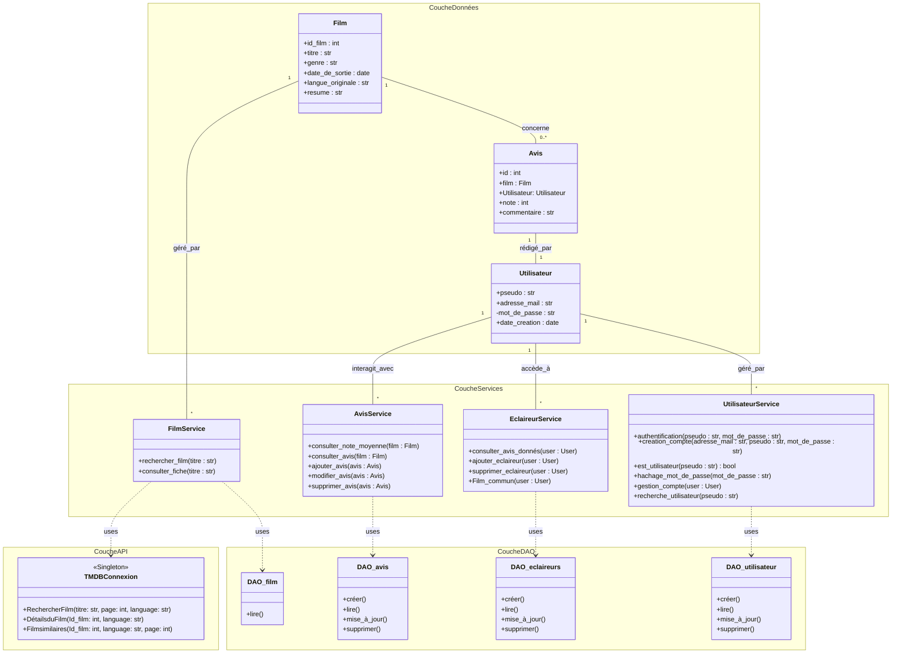

```mermaid
classDiagram
    namespace Couche Données {
        class Film {
            +id_film : int
            +titre : str
            +genre : str
            +date_de_sortie : date
            +langue_originale : str
            +resume : str
        }

        class Utilisateur {
            +pseudo : str
            +adresse_mail : str
            -mot_de_passe : str
            +date_creation : date
        }

        class Avis {
            +id : int
            +film : Film
            +Utilisateur: Utilisateur
            +note : int
            +commentaire : str
        }
    }

    namespace Couche DAO {
        class DAO_film {
            +lire()
        }

        class DAO_avis {
            +créer()
            +lire()
            +mise_à_jour()
            +supprimer()
        }

        class DAO_eclaireurs {
            +créer()
            +lire()
            +mise_à_jour()
            +supprimer()
        }

        class DAO_utilisateur {
            +créer()
            +lire()
            +mise_à_jour()
            +supprimer()
        }
    }

    namespace Couche Services {
        class FilmService {
            +rechercher_film(titre : str)
            +consulter_fiche(titre : str)
        }

        class AvisService {
            +consulter_note_moyenne(film : Film)
            +consulter_avis(film : Film)
            +ajouter_avis(avis : Avis)
            +modifier_avis(avis : Avis)
            +supprimer_avis(avis : Avis)
        }

        class EclaireurService {
            +consulter_avis_donnés(user : User)
            +ajouter_eclaireur(user : User)
            +supprimer_eclaireur(user : User)
            +Film_commun(user : User)
        }

        class UtilisateurService {
            +authentification(pseudo : str, mot_de_passe : str)
            +creation_compte(adresse_mail : str, pseudo : str, mot_de_passe : str)
            +est_utilisateur(pseudo : str) bool
            +hachage_mot_de_passe(mot_de_passe : str)
            +gestion_compte(user : User)
            +recherche_utilisateur(pseudo : str)
        }
    }

    namespace Couche API {
        class TMDBConnexion {<<Singleton>>
            +RechercherFilm(titre: str, page: int, language: str)
            +DétailsduFilm(Id_film: int, language: str)
            +Filmsimilaires(Id_film: int, language: str, page: int)
        }
    }

    %% Relations
    Film "1" -- "0..*" Avis : concerne
    Avis "1" -- "1" Utilisateur : rédigé_par
    Utilisateur "1" -- "*" AvisService : interagit_avec
    Utilisateur "1" -- "*" EclaireurService : accède_à
    Utilisateur "1" -- "*" UtilisateurService : géré_par
    Film "1" -- "*" FilmService : géré_par
    FilmService ..> TMDBConnexion : uses
    
    FilmService ..>DAO_film : uses
    AvisService ..> DAO_avis : uses
    EclaireurService ..> DAO_eclaireurs: uses
    UtilisateurService ..> DAO_utilisateur : uses
```